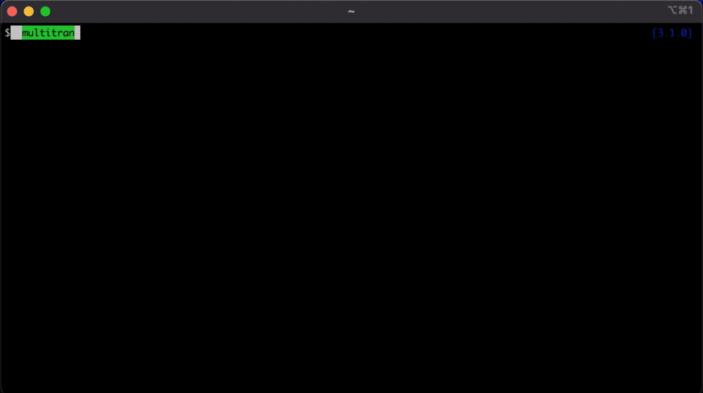

Multitran Command Line Interface (multitran_cli)
=============
Simple unofficial command line interface for [multitran.com](https://www.multitran.com) written in Python. It supports translations between the most common languages available on the website.





Installation
------------

multitran_cli works with Python 3. 
All you have to do to install it is typing following command into your terminal/cmd after navigating to the path where you have stored the downloaded release:

```bash
pip install multitran_cli-0.1.2.tar.gz
```

Usage
-----

It's super easy! Here's a quick example of using it to translate the word `beer` between english (`en`) and swedish (`sv`):

```bash
$ multitran en sv beer
Showing 2 of 2 result(s)

English                                                     Swedish
========                                                    =======
beer ...................................................... öl
beer glass ................................................ ölglas
```

Usage as Code example
------------

```
from multitran_cli import Dict

translator = Dict()
result = translator.translate("Freundschaft", from_language="de", to_language="ru")
print(result.translation_tuples[:2])
```
Returns following output:
```
[('Freundschaft, f =, -en', 'дружба (gen.)'), ('Freundschaft, f =, -en', 'приятельство (sociol.)')]
```

Available languages
------------
```
`af`  `African` 
`zh`  `Chinese` 
`cz`  `Czech` 
`nl`  `Dutch` 
`en`  `English` 
`eo`  `Esperanto` 
`de`  `German` 
`gr`  `Greek` 
`fi`  `Finnish` 
`fr`  `French` 
`ga`  `Irish` 
`it`  `Italian` 
`la`  `Latin` 
`jp`  `Japanse` 
`xal` `Kalmyk` 
`ko`  `Korean` 
`pt`  `Portugese` 
`ru`  `Russian` 
`sv`  `Swedish` 
`sk`  `Slovak` 
`sl`  `Slovenian` 
`es`  `Spanish` 
`ua`  `Ukrainian` 
`lv`  `Latvian` 
`et`  `Estonian` 
```

🤝 Contribute
------------
All kinds of contributions are welcome. E.g.:

- Submitting feedback
- Fixing bugs
- Or implementing a new feature.

Some opportunities for improvement:
- [x] Creating a consumable python package (in 0.1.2)
- [ ] Making the spaghetti code nice, clean and more efficient. (unfortunately I'm not a coder but I know that there are many opportunities for improvement)
- [ ] Switching from Beautifulsoup to [lxml](https://lxml.de/). lxml is faster as it is implemented in C
- [ ] Adding more features from multitran.com (e.g. search for phrases)


Acknowledgement
-------
The dict.cc website parser is based on [rbarons](https://github.com/rbaron/dict.cc.py) work. Thanks for that!

